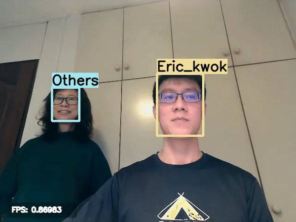
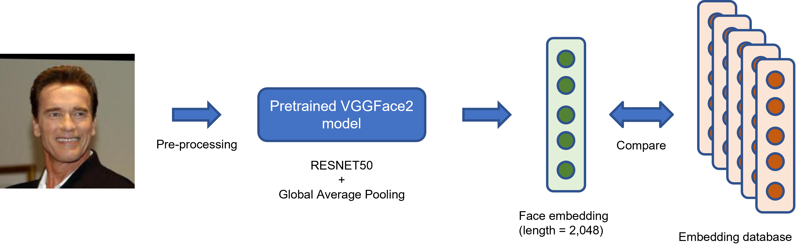
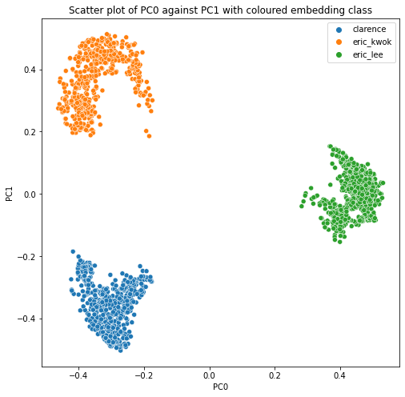
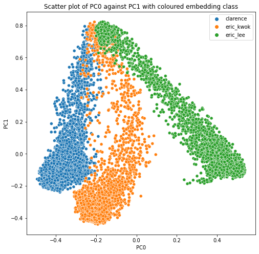
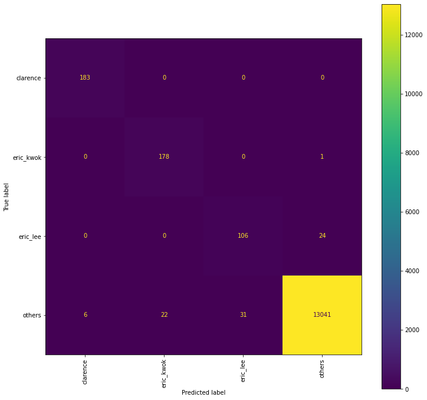
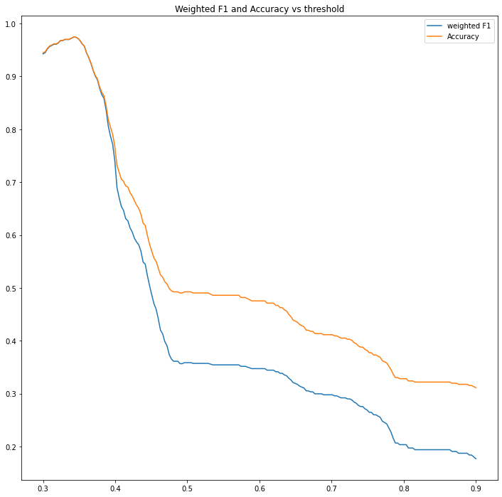

# PeekingDuckling
## 1. Description
This is an implementation of facial identification algorithm to detect and identify the faces of the 3 team members **Clarence**, **Eric Lee** and **Eric Kwok** from other detected faces (**Others**).

We will be using the [PeekingDuck](https://github.com/aimakerspace/PeekingDuck) framework for this mini project.

### 1.1 Example


## 2. Usage
### 2.1 Running the PeekingDuck nodes directly
```bash
python -m src.runner
```
```
optional arguments:
  -h, --help            show this help message and exit
  --type {live_video,recorded_video}
  --input_filepath INPUT_FILEPATH
                        The path to your video files if --type is 'recorded_video'
  --input_source INPUT_SOURCE
                        Input source integer value. Refer to cv2 VideoCapture class
```
### 2.2 Using the PeekingDuck from the web interface
```bash
python -m src.camera
```

### 2.3 Face recognition using only 1 photo
```bash
python -m src.app
```
On a separate terminal, issue the following command
```bash
python -m src.python_client <path_to_your_image>
```
## 3. Model 

### 3.1 Face Detection
In this repository, we will be using the the library from [PeekingDuck](https://github.com/aimakerspace/PeekingDuck) to perform facial detection. 

For the face detection, the MTCNN pretrained model from the PeekingDuck's framework was being implemented.

### 3.2 Face Identification
For face identification, cropped images (224 x 224) obtained from Face detection stage is passed to the pretrained RESNET50 model (trained on [VGGFace2](https://arxiv.org/abs/1710.08092) dataset) with a global average pooling layer to obtain the Face Embedding. The face embedding is then used to compare to the database of face embeddings obtained from the members to verify if the detected face belongs to one of the 3 members.<br>

Comparison of the face embedding is done using a 1-NN model, and a threshold is set using cosine similarity, below which the image will be classified as _'others'_

The face embeddings were built using 651 images from Clarence, 644 images from Eric Kwok and 939 images from Eric Lee.

**A low dimensional representation** of the face embedding database of the 3 members using the first 2 principal components from the PCA of the face embeddings can be found in the image below. <br>


**Augmentation** to have the 4 extra images per image using random rotations of (+/-) 20 degrees and random contrasting were used in building the database so that it can be more robust. The PCA of the augmented database can be seen in the image below <br>


## 4. Performance 
The facial classification algorithm was able to achieve an **overall accuracy of 99.4%** and a **weighted F1 score of 99.4%** with 183 test images from Clarence, 179 from Eric Kwok, 130 from Eric Lee and 13,100 images from non-members obtained from this [database](http://vis-www.cs.umass.edu/lfw/#download). 

Below shows the confusion matrix from the test result. <br>
 .

The test was conducted with the tuned threshold on the validation dataset, and the performance of the model with various thresholds can be seen in the graph below. The threshold that yields the best performance is around 0.342. <br>


## 5. Authors and Acknowledgements
The authors would like to thank the mentor [Lee Ping](https://gitlab.aisingapore.net/ngleeping) for providing us with the technical suggestions as well as the inputs on the implementation of this project.

**Authors:**
* [Eric Kwok](https://github.com/eric-kwok-nt) (Backend Facial Recognition)
* [Eric Lee](https://gitlab.aisingapore.net/hong_yeow_lee) (Implementation of PeekingDuck framework)
* [Clarence Lam](https://github.com/clarevoyance) (Frontend web interface)

**References** _(Non exhausive)_
* [PeekingDuck](https://github.com/aimakerspace/PeekingDuck)
* [How to Perform Face Detection with Deep Learning](https://machinelearningmastery.com/how-to-perform-face-detection-with-classical-and-deep-learning-methods-in-python-with-keras/)


